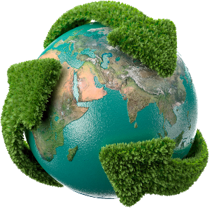

# Environment-Nectar  

### Goal!
:boom:To help our country's sweepers.
### How?
How do you feel when the sweepers of a city are looking for garbage?:worried: When we can help them by giving our garbage location :smiley:, so why not :smirk:. This app is made to give the location of municipal garbage to those whose job it is :star2:. and this is even not only right thing to do :heavy_check_mark:, but you can also collect points to get discounts in the program sponsor stores :currency_exchange:. It is coded with `React Native` as you can see in **master branch**.

# Demo
**An overview of the program(the whole app is programmed on light and dark mode):**
>You can see that in the beginning of the program, it was tried to be very attractive for our user :heavy_plus_sign: sign up with his phone number.

|Display the application logo|Start of the program|Sign up|Sign up|
|:-----------:|:-----:|:---------:|:---------:|
|||||
>User can help sweeper or garbage collector by choosing the type of waste they have and sending its location to them.

|Map|Map|Specify your garbage|Specify your garbage|
|:-----------:|:-----:|:---------:|:---------:|
|||||

## License & copyright

© Arshia Nikbakh -Student of University of Isfahan-

Check me on [:link:Linked in page](https://www.linkedin.com/in/arshia-nikbakht)
